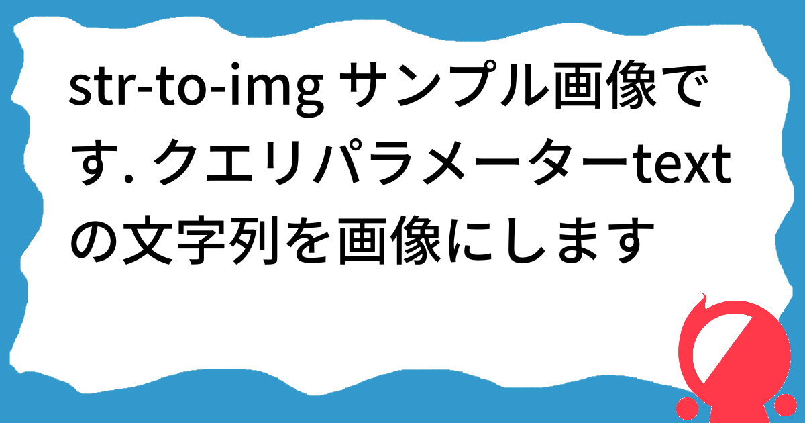

# Str To Img

URL クエリパラメーターで与えた文字列を画像に変換します.

サンプル画像
https://str-to-img.kajindowsxp.com?text=str-to-img+%E3%82%B5%E3%83%B3%E3%83%97%E3%83%AB%E7%94%BB%E5%83%8F%E3%81%A7%E3%81%99.+%E3%82%AF%E3%82%A8%E3%83%AA%E3%83%91%E3%83%A9%E3%83%A1%E3%83%BC%E3%82%BF%E3%83%BCtext%E3%81%AE%E6%96%87%E5%AD%97%E5%88%97%E3%82%92%E7%94%BB%E5%83%8F%E3%81%AB%E3%81%97%E3%81%BE%E3%81%99


## 使い方

このリポジトリをクローンします

```
git clone https://github.com/kajikentaro/str-to-img
cd str-to-img
```

以下コマンドで実行します

```
go run .
```

ブラウザから  
http://localhost:8080?text=テキスト  
のようにアクセスします

## 使い方(docker compose)

以下コマンドを実行します

```
docker compose up
```
